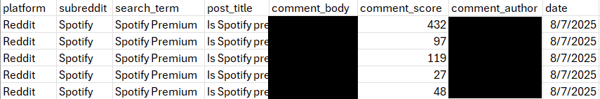
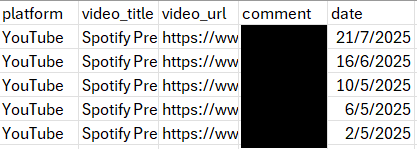
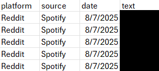

# Social Media Post Scraper: Reddit + YouTube Reviews

## Overview
This project collects and analyses user reviews from **Reddit** and **YouTube** to gain insights into public opinions on a specific product/service.  
It includes Python scripts to scrape data, clean it, and combine it into a single dataset of English-language comments.

## Data Sample
Here’s an example of the datasets generated by the scripts:





## Getting Started

1. Clone the repository:
```bash
git clone https://github.com/yourusername/social-media-analytics.git
```

2. Install dependencies:
```bash
pip install -r requirements.txt
```

3. Set up API keys:
- Replace the placeholders in the scripts with your own Reddit API and YouTube API credentials.
- Optionally, use a .env file for better security.

4. Run the scripts:
```bash
python Reddit.py
python Youtube.py
python Combine_reviews.py
```
## Output
The final combined dataset will be saved as combined_reviews.csv.
Sample data is included for testing purposes.

### Additional Notes
- Only English-language comments are retained.
- Duplicate comments are removed.
- You can adjust the number of posts or comments fetched by changing the limit parameter in the scripts.

